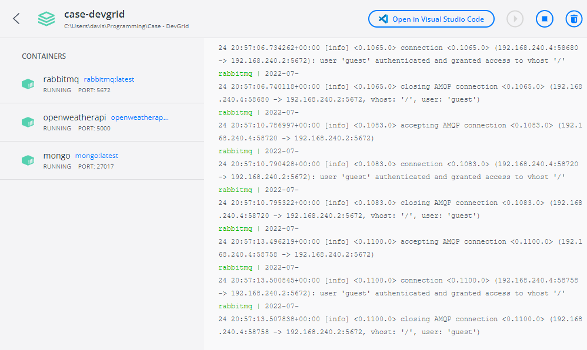
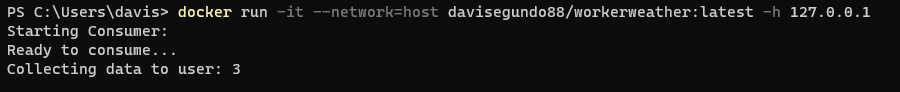
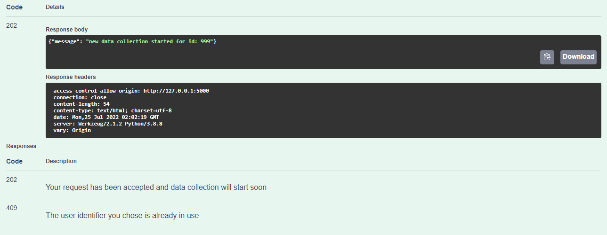
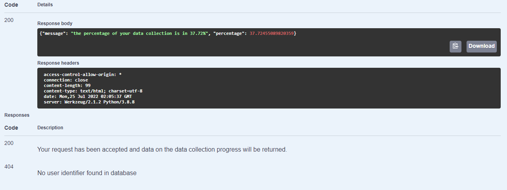
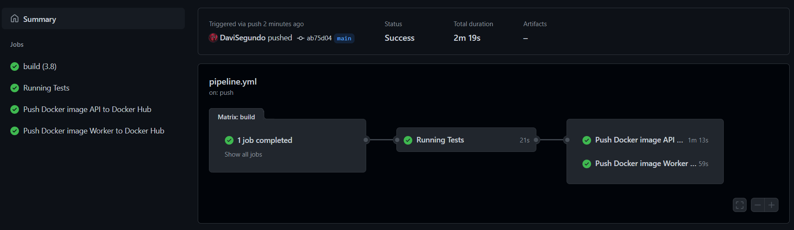
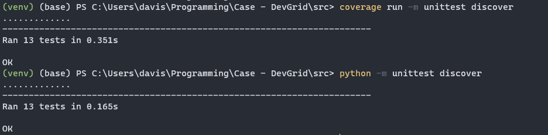
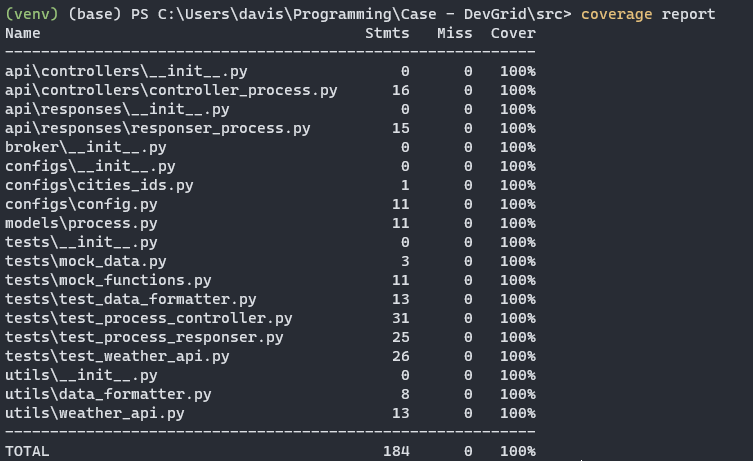
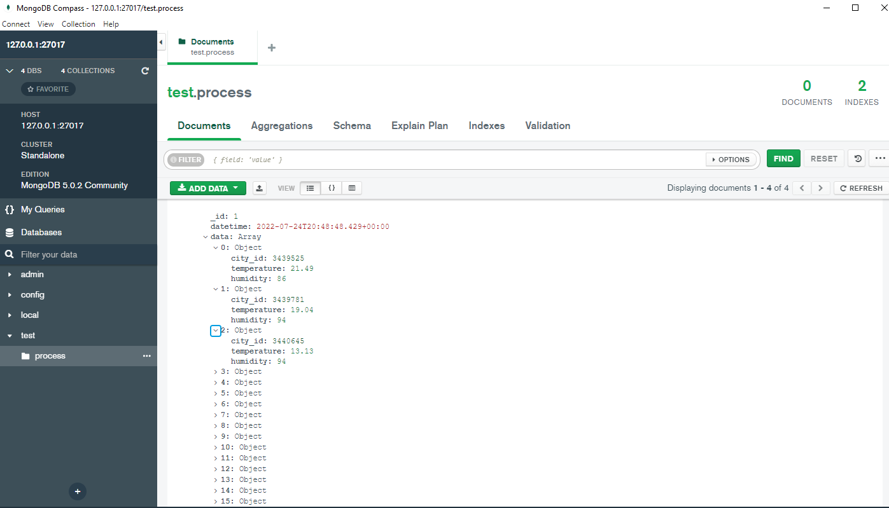
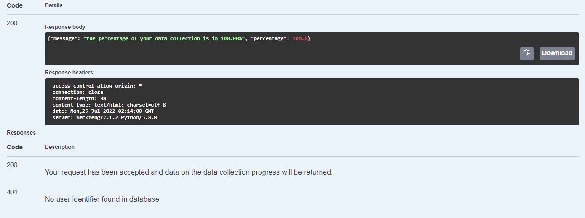
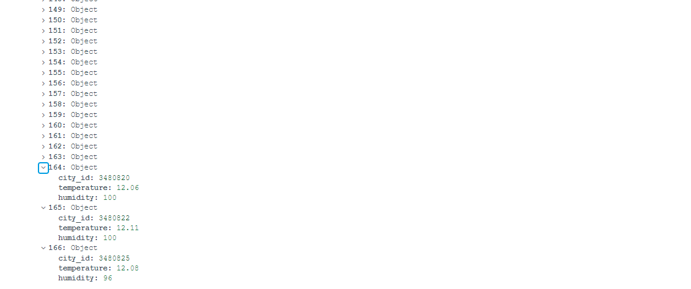

# Weather API Collector

## Project's goal
> This project was focused on building a service that collects data from a weather API and stores this information in a database. The beginning of the flow occurs when a user requests the beginning of a data collection, informing a unique identifier for it. This starts the collection of information and using the API that was built, the user can monitor the progress of their data collection.

## Basic architecture overview
The application flowchart was designed for the API to receive the user's request, save the basic information about the data in the database and send the request to start a new data collection to the broker, which will forward it to one of the workers available that will start collecting the data. 
<p align='center'>
    
</p>
In this way, workers save the new data acquired in the database. In addition, a request can be sent to the API to find out how the data collection is progressing.

## Requirements
Tools and packages required to successfully install this project.
- Python 3.8: [Python Releases](https://www.python.org/downloads/)
- Docker: [Docker Desktop](https://www.docker.com/products/docker-desktop/)

## Tools used
#### Flask:
The choice of the **Flask** framework was due to the familiarity I already have with it, but not only that, the ease and robustness to make the necessary implementations. In addition, the **flask-restx** library was another important factor, as it made the construction of **Swagger** a lot easier, which is something of paramount importance to have in a project with an API.

#### MongoDB:
**MongoDB** was chosen due to the non-relational data structure, i.e **NoSQL**, which in this context helps with the ease of manipulation of the structures that would be stored in it. In addition, it is one of the databases that I have used the most recently and personally I really like how it works and it also has a great **ORM** that helps a lot in the data manipulation part, providing a schematization for documents and a much more simplified way to carry out some queries.

#### RabbitMQ:
The choice to implement a broker in the project was due to the need for the requests to be **asynchronous**. So I opted for **RabbitMQ** as it provides an easy way to implement the basics and has excellent documentation. Thus, a **temporal decoupling** for the application flow and a way to organize data collection in a more logical way was achieved.

## Docker Installation
The idea of the project is to have the entire application in containers, so the services were placed in containers using Docker and a structure was prepared for their execution. Compose build and run files are available in the project.


### How to run
To run the project, follow the instructions below. It is worth noting that due to the nature of the project, the API, database and broker services were allocated in docker-compose for easier startup. As we can have several workers, its execution command can be used to start new instances if necessary.

#### First step:
Access the directory where the docker-compose file is located and run the following command. With this successful, the API, database and broker services will be started.
```sh
docker compose -f "docker-compose.yml" up -d --build
```
<p align='center'>
    
</p>

#### Second step:
After the previous services have started, it is now possible to allocate workers. Use the following command in the terminal to allocate 1 worker. For each new instance it is possible to use a new terminal.
```sh
docker run -it --network=host davisegundo88/workerweather:latest -h 127.0.0.1
```
<p align='center'>
    
</p>

#### Third step:
With all the services started, it is now possible to use all the features of the application. To access the API, go to **localhost:5000**, where you will find the Swagger interface and from there just perform the POST with a user identifier and monitor the data collection process through the GET route.

<p align='center'>
    
</p>
<p align='center'>
    
</p>


## Pipeline
A CI/CD pipeline was built to maintain control over the project in an automated way. For this, **GitHub Actions** was used, to build the application, run the tests and push the containers to DockerHub. In the following image, you can better see how the pipeline is structured.
<p align='center'>
    
</p>

## Tests
The tests are already running in the pipeline automatically, but in case you want to perform them locally, follow the instructions below:

Install project dependencies:
```sh
pip install -r requirements.txt
```
Access the directory where the project code is located:
```sh
cd src
```
You can use both commands below to run the tests, but using the coverage lib, it is possible to have a report about the code coverage:
```sh
python -m unittest discover
```
```sh
coverage run -m unittest discover
```
<p align='center'>
    
</p>
To see the test coverage report you can use the following command:
```sh
coverage report
```
<p align='center'>
    
</p>

## Extra project considerations

### Final result
As a final result, the application is working as expected in the initial design that was thought and is following what was requested. We can see in the following image how the data was stored inside the database:
<p align='center'>
    
</p>

It is also worth noting that a complete result of a data collection, where all the data was extracted and stored, being possible to check the **percentage of 100%** in the API:
<p align='center'>
    
</p>
<p align='center'>
    
</p>

### Possible future improvements
I believe that there are still some points to be improved to make this application more robust, such as better handling of exceptions and errors that may occur along the application's information flow, as fault handling is one of the **7 challenges** of implementing a **distributed system**. In addition, the limitation of 60 calls per minute that was imposed ended up limiting the performance of the application in general, where if there were many people requesting new data collections, they would all be competing for a limited amount of requests, which would delay pretty much everyone's speed. So, in **my personal opinion**, the best implementation choice here would be to process user requests through a queue with only 1 worker, so that the first user to request would receive all their data first and not have their collection speed reduced in case new people also request a collection. However, this would be a decision subject to a **more elaborate analysis**, as the choice would depend on several factors, such as the type of application being built, the profile of the clients that will use it and the objective we want to achieve through the use of this system, therefore, it would be necessary to refine it with a team focused more on product analysis and with the team to understand which would be the **best choices** here. Since perhaps **reducing the speed** of a collection for a person who is trustfully following the percentage could result in a **negative view of the product**, then maybe doing the collection in a sequential way warning people who have not yet started the collection would be something better so as **not to generate expectations** about the progress of the process itself.

## Authors

Davi Segundo Pinheiro – davisp2009@hotmail.com

You can find me here at: 
Github - [Davi S.P](https://github.com/DaviSegundo)
LinkedIn - [Davi Segundo](https://www.linkedin.com/in/davi-segundo-881401210/)